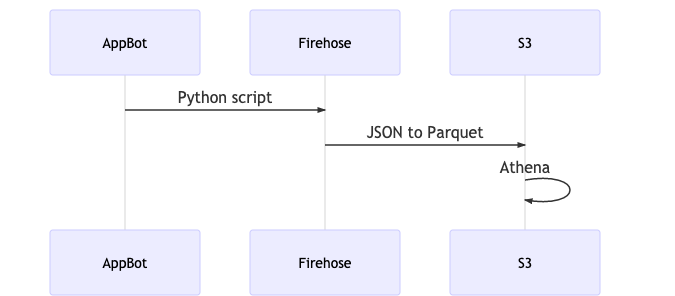

# Ratings App

## Stack

- Python script to fetch (generate!) data
- Define schema with Glue
- Use Kinesis S3 to store data into Parquet file
- Athena to compute aggregations

## Overview

- `fetch_ratings` python script generates (but should have fetched) ratings about Blinkist app. Dates could be set to only fetch a specific time window.

⚠️ Neither Appbot API or AppTweak seems to provide any free of charge API to programmatically fetch ratings. I was blocked on Appbot "API is available as an add-on to the Large & Enterprise plans.", and Apptweak ask for my credit card as well. Export feature is also premium. So, I've randomly generated data instead for this exercice purpose. ⚠️ 

Ratings are sent into Kinesis Firehose.

- A `Rating` table is defined in `Blinkist` Glue database. This schema is used to convert JSON data from Firehose to Parquet file located at `s3://blinkist/ratings/`. This data format is column oriented and can be easily queried by Presto / Hive engine, Athena or transfered to any Redshift instance


- `aggregate_ratings` python script sends Athena query to show how we can aggregate and store result there `s3://blinkist/aggregation/`

**Diagram**

[]()

## Motivation

- No scheduler has been set-up for lack of time & lack of specs (realtime?)
- Kinesis has been used to show infrastructure & serverless capabilities
- Athena has been used to aggregate instead of Spark or any Python script because easier, faster & serverless
- Parquet file is a best pratice to be able to load & query data easily

## Downside & Limitation

This ELT solution is far from any acceptable production-ready solution

- Athena & Firehose not part of AWS free tier default rating fetch is set to 100
- Scheduling should be properly set-up (Airflow)
- Python job should be isolated (lambda, docker)
- Error handling & Error recovery (Airflow & Dead letter queue)
- Incremental VS Full replace should be decided
- Output storage should be used instead of CSV (ES, RDS)


### Aggregation Explanations


```sql
WITH 

    -- Table that duplicates ratings rows for same user
    RankedRatings AS 
    (SELECT author,
         published_date,
         rating,
         platform,
         rank()
        OVER (PARTITION BY author
    ORDER BY  published_date DESC) AS rnk
    FROM "blinkist"."ratings" ), 
    
    -- Table that aggregates by date, platform and rating
    AvgRating AS 
    (SELECT published_date,
         platform,
         avg(rating) AS avgRating
    FROM RankedRatings
    WHERE rnk = 1
    GROUP BY  1,2), 
    
    -- Table that computes cumulative avg by date over each platform
    AllCumulativeRating AS 
    (SELECT published_date,
         platform,
         avg(avgRating)
        OVER (PARTITION BY platform order by published_date ASC rows
        BETWEEN unbounded preceding
            AND current row) AS cumAvg
    FROM AvgRating )
    
-- Finally join AvgRating with AllCumulativeRating tables to 
-- determine if rating has decreased or increased for each day
SELECT a.published_date,
         a.avgRating,
         a.platform,     
    CASE
    WHEN a.avgRating < b.cumAvg THEN
    'Customer Rating Decreased'
    ELSE 'Customer Rating Increased'
    END
FROM AvgRating a
JOIN AllCumulativeRating b
    ON a.published_date = b.published_date and a.platform = b.platform
ORDER BY a.published_date;
```

## Installation

### Prerequisites

- Terraform CLI 0.12
- AWS environment variables
- AWS CLI
- Python3   

### Infrastructure

```bash
cd infrastructure
terraform init
terraform plan
terraform apply
```

## Run

Replace `QUERYID` by Athena queryId printed by `aggregate_ratings.py`

```bash 
cd scripts
python fetch_ratings.py
python aggregate_ratings.py
aws s3 cp s3://blinkist/aggregation/QUERYID.csv result.csv

```
